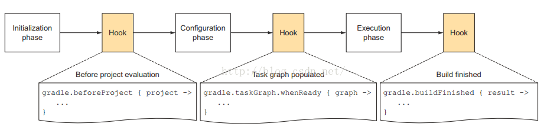

# MultiChannelPlugin
 [](https://www.apache.org/licenses/LICENSE-2.0.html)

多渠道打包gradle插件，支持打包apk和aar
- 读取渠道配置文件，动态生成`ProductFlavor`
- 重命名apk和aar文件名字，根据需要指定输出目录
- 运行多渠道打包任务（`multiChannel`）时，可以选择禁用不必要的任务（`lint`, `debug`和`test`），提升打包速度

# 添加插件依赖
```groovy
classpath 'io.github.tubb:multichannel:1.0.1'
// apply multi channel plugin
apply plugin: 'io.github.tubb.multichannel'
```
# 如何使用
插件在顶层定义了`appChannel`dsl，并且在`appChannel`dsl下分别定义了`channelFlavorConfig`、`bundleOutputConfig`和`taskConfig`三个dsl，分别对应于上面三项功能，下面来看看如何配置

## `channelFlavorConfig`dsl
```groovy
appChannel {
    channelFlavorConfig {
        channelConfigFilePath '/Users/tubingbing/StudioProjects/MultiChannelPlugin/app/channels.txt'
        configProductFlavor { name ->
            if ('qq'.equals(name)) { // for test
                return {
                    dimension 'default'
                    manifestPlaceholders = [ channel:"${name}_yyb" ]
                }
            } else {
                return {
                    dimension 'default'
                    manifestPlaceholders = [ channel:name ]
                }
            }
        }
        // must call after configProductFlavor dsl
        createChannel()
    }
}
```
可以看到`channelFlavorConfig`dsl主要用来配置`渠道文件`的路径（绝对路径）。每个`ProductFlavor`对应的配置跟平常配置`ProductFlavor`一样。这里要注意的是要主动调用由插件导出的`Project.createChannel()`方法来主动创建多个`ProductFlavor`（`Configuration phase`阶段）



## `bundleOutputConfig`dsl
```groovy
appChannel {
    bundleOutputConfig {
        outputDir '/Users/tubingbing/channels'
        renameBundleFile { project, variant ->
            // rename apk file
            project.name + '-' + variant.flavorName + '-' + variant.buildType.name + '-' + variant.versionName + '.apk'
        }
    }
}
```
`bundleOutputConfig`dsl主要用来做
- 指定apk和aar输出目录（绝对路径）
- 按自己的需要重命名apk和aar文件名字
## `taskConfig`dsl
```groovy
appChannel {
    taskConfig {
        disableLintTask true
        disableDebugTask true
        disableTestTask true
    }
}
```
现阶段设定了`lint`、`debug`和`test`三种task的启用禁用开关，按自己的需要来配置吧

# aar包的支持
由于apk包和aar包最终输出机制基本一致，所以插件同样适用于aar打多渠道包，插件的使用基本是跟打apk包一致，具体可以查看[librarytest](https://github.com/TUBB/MultiChannelPlugin/blob/master/librarytest/build.gradle)

# 运行
```groovy
./gradlew clean :moduleName:multiChannel
```

# Note
由于`Android gradle plugin`版本向后兼容性不是很理想，自己编写、测试插件代码是基于
```groovy
distributionUrl=https\://services.gradle.org/distributions/gradle-4.1-all.zip
```
```groovy
classpath 'com.android.tools.build:gradle:3.0.1'
```
如在其它版本遇到问题，欢迎提`Issues`和提交`PR`